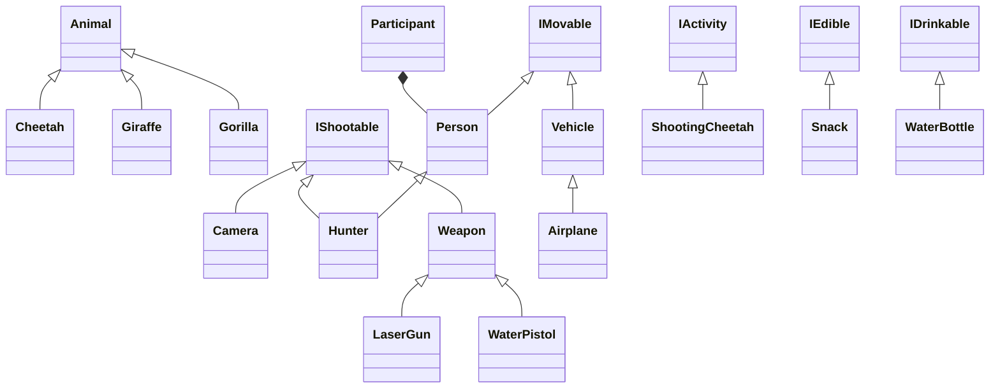
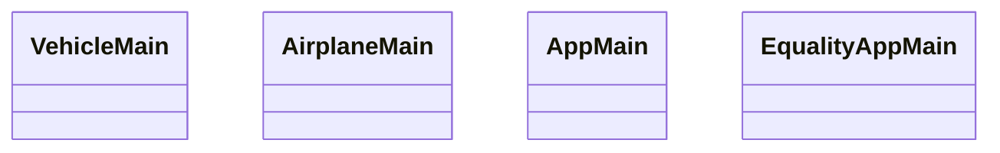
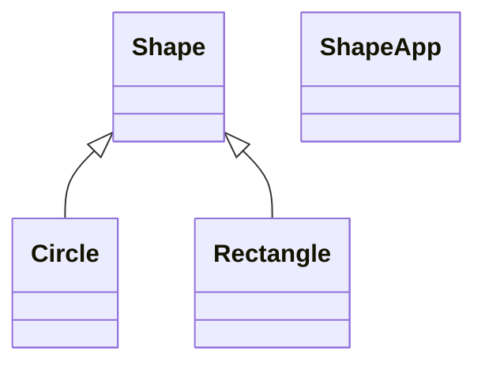

# Sparta Safari Park

The project contains a number of subpackages related to different aspects of Java development taught 
at Sparta Bootcamp. 

The base package is `com.sparta.ec`, where the subpackages are located.

## `collections`

Contains:

- `CollectionsApp3`: Class with a `main` method containing:
  - examples of usage of `ArrayList<>`;
  - an exercise on `HashSet<>` and `HashMap<>`, and iterations over collections.  
- `CollectionsLabHomework` : Class with the homework related to collections. 

## `enums`

- `Enum`: simple example of usage of `enum`.
- `PizzaSize`: example of `enum` with properties.
- `Planet`: exercise with enum with properties.

## `primitive_types`

- `PrimitiveAppMain`: operators on primitive types: double, int, float.

## `safaripark`

A slightly bigger project, containing various aspects of Object Orienting Programming. 

Other classes with main methods:
 

## `Shapes`

A more simplified example of inheritance with `extends`.

## `stringmanipulation`

Lesson about StringBuilder and advantages over simple String manipulations.

